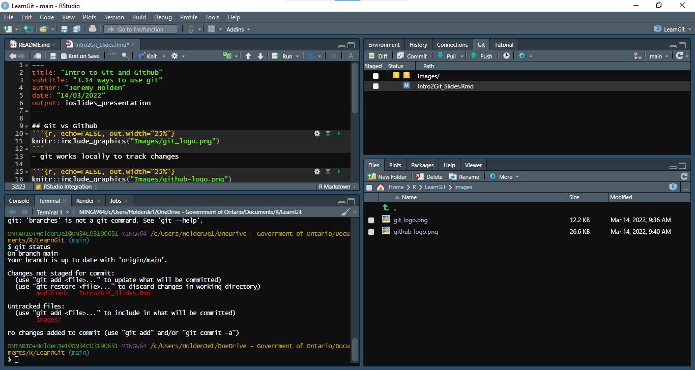
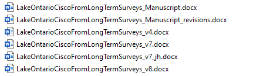

# Git vs Github
```{r, echo=FALSE, out.width="25%"}
knitr::include_graphics("Images/git_logo.png")
```
- git works locally to track changes

```{r, echo=FALSE, out.width="25%"}
knitr::include_graphics("Images/github-logo.png")
```
- github focuses on collaboration tools


# Primary Commands

- commit: saves a snapshot of your work
- pull: looks for changes between local and remote copies. Requests changes to remote.

### Other important terms
- branch
- merge
- status
- log

# RStudio Integration

```{r, echo=FALSE, out.width="100%"}

```

# Feature 1 - file history

Does this look familiar?

```{r echo=FALSE, out.width="75%"}

```

- git allows you to track changes (and who changed them, and WHY!) for the life of a project in a single file

# Feature 2 - assign homework
- Use the *Issues* feature in Github to assign homework, to yourself or others and track progress

```{r echo=FALSE, out.width="75%"}

```

# Feature 3 - collaborate of files
Using commits, pull requests and merges to work on files between collaborators.

```{r echo=FALSE, out.width="75%"}

```


# Danger zone - Live Demo!

